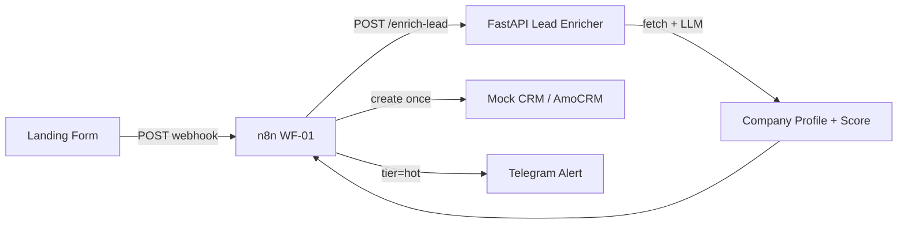

# Lead Enrichment Parser

Production-minded portfolio demo: **landing form → n8n → FastAPI enricher → CRM** with LLM company extraction and lead scoring.

## Problem

In a digital agency, managers received leads (name, phone, email) and manually researched the company — **15–20 minutes per lead**.  
50 leads/day × 15 min = **12.5 hours** of manual work daily.

## Solution



Enrichment happens **before** CRM create — one write with full context.

## Quick Start

### Prerequisites

- Docker & Docker Compose
- [Ollama](https://ollama.com) running locally on `:11434` with `llama3.2`:
  ```bash
  ollama pull llama3.2
  ollama serve
  ```

### Run

```bash
cd sales_parser
cp .env.example .env
make up
```

Wait ~30s for services, then:

```bash
make ports           # check host ports are free
make health          # {"status": "ok"}
make enrich          # direct API call with sample lead
make demo            # full demo script
```

### Ports (host → container)

Defaults are chosen to avoid clashes with common stacks (8080, 5678, 5432):

| Service | Host port | Container | Env var |
|---|---|---|---|
| Lead Enricher | **18080** | 8080 | `ENRICHER_HOST_PORT` |
| n8n | **15678** | 5678 | `N8N_HOST_PORT` |
| Postgres | **55433** | 5432 | `POSTGRES_HOST_PORT` |
| Ollama | 11434 | (host, not in compose) | `OLLAMA_BASE_URL` |

If ports are busy, edit `.env` and run `make ports` again. Also update `N8N_WEBHOOK_URL`, `ENRICH_URL`, `DATABASE_URL_HOST`, and `demo/index.html` webhook URL.

### Import n8n Workflow

**Option A — CLI (recommended, nodes appear reliably):**

```bash
make import-workflow
```

Then open http://localhost:15678 → **WF-01 Lead Enrichment** → toggle **Active** (top-right).

**Option B — UI import:**

1. Open http://localhost:15678
2. **Workflows** (left sidebar) → **Add workflow** → **Import from File**
3. Select `workflows/export/WF-01-lead-enrichment.json`
4. Save and toggle **Active**

Do **not** paste JSON into an empty canvas — use **Import from File**.

Webhook URL (after Active): `http://localhost:15678/webhook/new-lead`

### Demo Form

Open `demo/index.html` in browser (or serve with `python -m http.server 3000` from `demo/`).  
Submit uses n8n webhook — response is immediate; enrichment runs async.

### Fixture Domains (no external network)

| Email domain | Fixture |
|---|---|
| `logistics-de.ru` | logistics company |
| `digital-agency.io` | marketing agency |
| `minimal-startup.com` | minimal page (partial) |

Set `USE_FIXTURE_FETCHER=true` in `.env` to always use fixtures.

## API

See [docs/API.md](docs/API.md).

```bash
curl -X POST http://localhost:18080/enrich-lead \
  -H "Content-Type: application/json" \
  -d @demo/sample_leads.json
```

## Architecture Decisions

| Decision | Rationale |
|---|---|
| Enrich before CRM create | Single write, no update race |
| LLM parses text only | No hallucinated URLs; fetch is deterministic |
| Postgres cache 24h | Dedup by domain, faster repeat leads |
| Idempotency by `request_id` | Safe n8n retries |
| Fixture fetcher for demo | No flaky CI / portfolio demos |
| Ollama on host | GPU access; not bundled in compose |
| Graceful LLM fallback | Rule-based profile if Ollama down |

## Tests

```bash
cd services/lead-enricher
python3 -m venv .venv && .venv/bin/pip install -r requirements.txt
make test          # 53 tests, no Docker/Postgres/Ollama required
```

Test layers: domain logic, enrichment service, repositories, infrastructure, API (all use in-memory DI).

## Connecting AmoCRM v4

Replace **Mock CRM Create** node in n8n with AmoCRM HTTP Request:

1. OAuth2 token → `Authorization: Bearer {token}`
2. `POST https://{subdomain}.amocrm.ru/api/v4/leads`
3. Map `crm_payload` fields to AmoCRM custom fields
4. Add tag `enrich_failed` on partial enrichment (already in payload tags)

## ROI

- **Before:** 50 leads × 15 min = 12.5 h/day manual research
- **After:** ~5 sec automated enrich + manager review only for hot leads
- **Payback:** immediate for agencies with >20 inbound leads/day

## Interview Pitch

See [docs/INTERVIEW_PITCH.md](docs/INTERVIEW_PITCH.md) — 30 sec + 2 min technical deep-dive.

## Stack

FastAPI · Pydantic v2 · PostgreSQL · Ollama · n8n · httpx · trafilatura · Docker Compose
